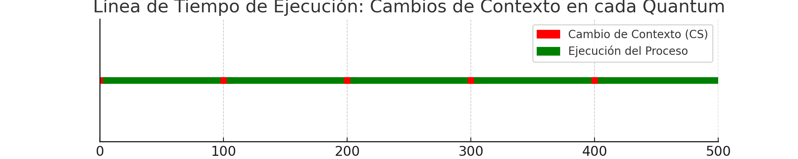

# Informe: Laboratorio 3-Planificador de procesos

Integrantes del grupo(03):
* Lautaro Ezequiel Deco
* Nehuen Emanuel Guevara
* Tomas Fabian Torres
* Fefe xd

## Primera parte: Estudiando el planificador de xv6-riscv


### ¿Qué política de planificación utiliza `xv6-riscv` para elegir el próximo proceso a ejecutarse?

Xv6 implementa una política de planificación muy básica llamada *Round Robin* donde cada proceso se ejecuta por turnos, es decir, cada uno se ejecuta en un tiempo fijo antes de ser interrumpido y pasar a ejecutar el sieguiente. Obviamente el proceso puede no haber acabado su ejecución por lo cual se deberá guardar toda la información asociada a ese proceso antes de ejecutar el proximo. Gracias a la implementacion del scheduler de xv6 todos los procesos terminaran en algun momento de ejecutarse por completo.


###   ¿Cúales son los estados en los que un proceso puede permanecer en xv6-riscv y qué los hace cambiar de estado?

```c
     enum procstate { UNUSED, USED, SLEEPING, RUNNABLE, RUNNING, ZOMBIE };
```

-**UNUSED** : El proceso no esta en uso.
-**USED** :  El proceso esta en uso.
-**SLEEPING** : El proceso esta durmiendo, Esta esperando que ocurra un evento.
-**RUNNEABLE** :  El proceso está listo para ser ejecutado. (READY).
-**RUNNING** : El proceso está en ejecución.
-**ZOMBIE**:  El proceso ha terminado y está esperando a que su padre recoja su estado.


- Las funciones que hacen cambiar de estado a los procesos son las siguientes:

  - **procinit** : Inicializa el arreglo de procesos cambiando sus estados a UNUSED:

  ``` c
   (p->state = UNUSED)
  ```

  - **allocproc** : Cambia el estado de un proceso a USED:

  ```c
  (p->state = USED)
  ```

  - **freeproc** : Libera un proceso dejando su estado en UNUSED: 

  ```c
  (p->state = UNUSED)
  ```

  - **userinit** : Deja un proceso listo para correr, es decir, cambia el estado de un proceso a RUNNABLE:

  ```c
  (p->state = RUNNABLE) 
  ```

  - **fork** : Esta funcion puede allocar un proceso a traves de *allocproc*, dejarlo listo para correr a traves de *userinit* o liberarlo si algun paso no funciono a traves de *freeproc*.  

  - **exit** : Cambia su estado a ZOMBIE para que el proceso padre lo pueda recoger: 

  ```c
  (p->state = ZOMBIE)
  ```

  - **scheduler** : Al primer proceso que encuentre con el estado RUNNABLE en el arreglo de procesos lo cambia a RUNNING. 

  - **yield** : Cambia el estado de un proceso en ejecucion, es decir:

  ```c
  /* Modifica de */ (p->state = RUNNING) 
   /* a */          (p->state = RUNNABLE)
  ```

  - **sleep** : Manda a dormir a un proceso, es decir, cambia su estado a SLEEPING 

  ```c 
  (p->state SLEEPING)
  ```

  - **wakeup** : Despierta todos los procesos de un canal y cambia su estado de SLEEPING a RUNNABLE. 

  - **kill** : Necesita despertar a un proceso en caso de estar dormido para verificar si se debe eliminar, es decir cambia el estado de un proceso de SLEEPING A RUNNABLE. 


### ¿Qué es un *quantum*? ¿Dónde se define en el código? ¿Cuánto dura un *quantum* en xv6-riscv?

#### ¿Qué es un quantum?

Un quantum es una unidad de tiempo durante la cual un proceso se ejecuta en un sistema de tiempo compartido. Al finalizar el quantum, si el proceso no ha terminado, el sistema operativo interrumpe su ejecución y da la oportunidad a otro proceso de ejecutarse. Esto permite la multitarea y asegura que todos los procesos reciban tiempo de CPU.

#### ¿Dónde se define en el código?

 El quantum se define en:
- *Archivo*: start.c
- *Función*: timerinit
- *Línea relevante*: 
```c
int interval = 1000000; // cycles; about 1/10th second in qemu.
```

#### ¿Cuánto dura un quantum en xv6-riscv?

El quantum en xv6-riscv dura 1000000 ciclos, lo que equivale aproximadamente a 1/10 de segundo en QEMU. Este valor se usa para configurar el registro CLINT_MTIMECMP y determinar el momento exacto en el cual deberia haber una timer interrupt para avisarle al proceso que su quantum termino y devolverle el control al sistema operativo.


### ¿En qué parte del código ocurre el cambio de contexto en `xv6-riscv`? ¿En qué funciones un proceso deja de ser ejecutado? ¿En qué funciones se elige el nuevo proceso a ejecutar?

#### ¿En qué parte del código ocurre el cambio de contexto en `xv6-riscv`?

Existe una función llamada **swtch**  implementada  en el archivo swtch.S (código maquina) la cual es la encargada de hacer posible el cambio de contexto. 


   Luego otra función **Sched** es el encargado de realizar el cambio de contexto cuando un proceso ya no puede continuar ejecutándose. Lo que hace este swtch es cambiar el contexto del proceso al del scheduler


   Luego esta función es llamada en otras como **scheduler**  que es la que decide que proceso se va a ejecutar a continuación y llama a swtch para realizar el cambio de contexto del scheduler al del proceso a ejecutarse 


#### ¿En qué funciones un proceso deja de ser ejecutado? 

Hay varias funciones donde un proceso deja de ser ejecutado, ya sea por un cambio de contexto o por un cambio de estado. Entre ellas estan:
 - Funcion **swtch**: Es la funcion en codigo maquina encargada de hacer el cambio de contexto 
 - Funcion **sleep**: Esta fucion manda a dormir un  poceso 
 - Funcion **yeild**: Cunado un proceso usa esta funcion, sede voluntariamente CPU
 - Funcio **sched**: Realiza un cambio de contexto cuando sea necesario llamando a swtch
 -  Funcion **exit** : Provoca tambien con la diferencia que sera de manera definitiva


#### ¿En qué funciones se elige el nuevo proceso a ejecutar?

Dentro de la función 
```c 
void scheduler(void)		
```
 se encuentra un bucle infinito donde  se recorre un  arreglo de procesos para buscar el siguiente proceso que este en estado RUNNEABLE Cuando encuentra uno, realiza el cambio de contexto usando la función :
 ```c 
swtch(&c->context, &p->context); // swtch 
 ```


-Donde  (**p->contex**)  es el puntero al contexto del proceso nuevo , el que se ejecutara a continuación.

-Luego **(c->context)**  es un puntero al proceso actual, donde los registros serán guardados para luego utilizarlos mas adelante  

-Luego la funcion guarda el indice donde se quedo para seguir recorriendo desde alli.


Ademas en la Función 
```c 
void sched(void)		
```
se realiza toda la lógica para que el proceso actual derive CPU para que se ejecute el siguiente proceso encontrado por la función anterior 


...
### ¿El cambio de contexto consume tiempo de un *quantum*?

Sí, el cambio de contexto consume tiempo del *quantum*. Basamos esta respuesta en un experimento en el que se disminuyó el *quantum* a valores muy pequeños y se observó el comportamiento del sistema. 

En el experimento, al reducir el *quantum* a 100 ticks, se observó que el sistema no podía ni siquiera inicializar el sistema operativo xv6. Esto sugiere que para iniciar la terminal, se deben realizar una serie de procesos que dependen de los cambios de contexto para avanzar. Al tener un *quantum* tan reducido, el tiempo consumido por los cambios de contexto es suficiente para agotar el *quantum* disponible, impidiendo que los procesos ejecuten su código efectivamente. Como resultado, el sistema entra en un bucle de cambios de contexto sin ejecutar el código necesario, confirmando que el cambio de contexto consume parte del *quantum*.

Podemos crear una visualización gráfica en Python para presentar la línea de tiempo de ticks y cambios de contexto. La gráfica puede mostrar cada quantum y destacar el tiempo consumido por el cambio de contexto al inicio de cada quantum. Esta imagen es acorde a como creemos que funcionan los quantums y cambios de contexto en xv6:





- Cada segmento rojo al inicio de un quantum representa el tiempo consumido por el **cambio de contexto (CS)**.
- Los segmentos verdes representan el tiempo restante del **quantum** dedicado a la **ejecución del proceso**.

Esto ilustra cómo el cambio de contexto consume una porción del quantum antes de que el proceso comience a ejecutar sus instrucciones.

Notemos que esta es una mera representacion de como pensamos que funciona xv6.

## Segunda parte: Medir operaciones de cómputo y de entrada/salida

Primero que nada definimos la **metrica** que utilizamos para esta parte del laboratorio y que usamos al hacer las mediciones de los experimentos. Notar que la naturaleza de las operaciones CPU e I/O es diferente por lo cual buscamos una metrica que trate de unificar o que permita comparar los resultados obtenidos
`cpubench`:
Metrica ->  k-operaciones de  CPU por tick (**kops / ticks**)  -> `metric = (total_cpu_kops * 1000) / elapsed_ticks`
`iobench`:
Metrica -> operaciones I/O por tick (**iops / ticks**) -> `metric = (total_iops * 1000) / elapsed_ticks`

Algo a destacar y notar es que los **kops** y **iops** son multiplicados por 1000, esta fue una solucion que dimos ya que nos dimos cuenta que a menudo la metrica en `iobench` daba un numero cercano a 0(aproximadamente), y como sabemos que se redondea, notamos que perdiamos informacion asi que decidimos multiplicar por 1000 para dar un tipo de "rescalado" a nuestra metrica para asi no perder informacion, luego en`cpubench`tambien lo hicimos para dar un tipo de uniformidad a la hora de comparar resultados.

### Experimento 1: ¿Cómo son planificados los programas iobound y cpubound?

#### Resultados de experimento 1:

#### iobench 10 &
| id | Type      | name_metric | Metric | Start_tick | Elapsed_tick |
|----|-----------|-------------|--------|------------|--------------|
| 4  | [iobench] | Perfomance  | 3820   | 2041       | 268          |
| 4  | [iobench] | Perfomance  | 3953   | 2309       | 259          |
| 4  | [iobench] | Perfomance  | 3968   | 2569       | 258          |
| 4  | [iobench] | Perfomance  | 3968   | 2828       | 258          |
| 4  | [iobench] | Perfomance  | 3953   | 3087       | 259          |
| 4  | [iobench] | Perfomance  | 3953   | 3346       | 259          |
| 4  | [iobench] | Perfomance  | 3968   | 3606       | 258          |
| 4  | [iobench] | Perfomance  | 3953   | 3865       | 259          |
| 4  | [iobench] | Perfomance  | 3953   | 4125       | 259          |
| 4  | [iobench] | Perfomance  | 3968   | 4384       | 258          |


#### iobench 10 &; iobench 10 &; iobench 10 &
| id | Type      | name_metric | Metric | Start_tick | Elapsed_tick |
|----|-----------|-------------|--------|------------|--------------|
| 8 | [iobench] | Perfomance | 3112 | 2284 | 329 |
| 8 | [iobench] | Perfomance | 5595 | 2615 | 183 |
| 8 | [iobench] | Perfomance | 4923 | 2799 | 208 |
| 8 | [iobench] | Perfomance | 4946 | 3007 | 207 |
| 8 | [iobench] | Perfomance | 4718 | 3215 | 217 |
| 8 | [iobench] | Perfomance | 7937 | 3434 | 129 |
| 8 | [iobench] | Perfomance | 3820 | 3566 | 268 |
| 8 | [iobench] | Perfomance | 4162 | 3834 | 246 |
| 8 | [iobench] | Perfomance | 4899 | 4083 | 209 |
| 8 | [iobench] | Perfomance | 4357 | 4292 | 235 |

| id | Type      | name_metric | Metric | Start_tick | Elapsed_tick |
|----|-----------|-------------|--------|------------|--------------|
| 5  | [iobench] | Perfomance  | 4063   | 2283       | 252          |
| 5  | [iobench] | Perfomance  | 5333   | 2537       | 192          |
| 5  | [iobench] | Perfomance  | 3710   | 2731       | 276          |
| 5  | [iobench] | Perfomance  | 4432   | 3009       | 231          |
| 5  | [iobench] | Perfomance  | 4047   | 3240       | 253          |
| 5  | [iobench] | Perfomance  | 4511   | 3493       | 227          |
| 5  | [iobench] | Perfomance  | 5657   | 3721       | 181          |
| 5  | [iobench] | Perfomance  | 3084   | 3902       | 332          |
| 5  | [iobench] | Perfomance  | 4231   | 4236       | 242          |
| 5  | [iobench] | Perfomance  | 5505   | 4482       | 186          |


| id | Type      | name_metric | Metric | Start_tick | Elapsed_tick |
|----|-----------|-------------|--------|------------|--------------|
| 7  | [iobench] | Perfomance  | 4612   | 2284       | 222          |
| 7  | [iobench] | Perfomance  | 3112   | 2506       | 329          |
| 7  | [iobench] | Perfomance  | 5120   | 2837       | 200          |
| 7  | [iobench] | Perfomance  | 3864   | 3039       | 265          |
| 7  | [iobench] | Perfomance  | 3555   | 3306       | 288          |
| 7  | [iobench] | Perfomance  | 5278   | 3595       | 194          |
| 7  | [iobench] | Perfomance  | 4284   | 3789       | 239          |
| 7  | [iobench] | Perfomance  | 4946   | 4028       | 207          |
| 7  | [iobench] | Perfomance  | 5094   | 4235       | 201          |
| 7  | [iobench] | Perfomance  | 5171   | 4436       | 198          |


#### cpubench 10 &

| id | Type       | name_metric | Metric  | Start_tick | Elapsed_tick |
|----|------------|-------------|---------|------------|--------------|
| 12 | [cpubench] | Perfomance  | 3334360 | 13404      | 161          |
| 12 | [cpubench] | Perfomance  | 3334360 | 13566      | 161          |
| 12 | [cpubench] | Perfomance  | 3334360 | 13728      | 161          |
| 12 | [cpubench] | Perfomance  | 3313777 | 13889      | 162          |
| 12 | [cpubench] | Perfomance  | 3334360 | 14051      | 161          |
| 12 | [cpubench] | Perfomance  | 3334360 | 14213      | 161          |
| 12 | [cpubench] | Perfomance  | 3334360 | 14375      | 161          |
| 12 | [cpubench] | Perfomance  | 3313777 | 14536      | 162          |
| 12 | [cpubench] | Perfomance  | 3334360 | 14698      | 161          |
| 12 | [cpubench] | Perfomance  | 3334360 | 14860      | 161          |


#### cpubench 10 &; cpubench 10 &; cpubench 10 &

| id | Type       | name_metric | Metric  | Start_tick | Elapsed_tick |
|----|------------|-------------|---------|------------|--------------|
| 22 | [cpubench] | Perfomance  | 1111453 | 21567      | 483          |
| 22 | [cpubench] | Perfomance  | 1111453 | 22053      | 483          |
| 22 | [cpubench] | Perfomance  | 1111453 | 22539      | 483          |
| 22 | [cpubench] | Perfomance  | 1111453 | 23025      | 483          |
| 22 | [cpubench] | Perfomance  | 1111453 | 23511      | 483          |
| 22 | [cpubench] | Perfomance  | 1111453 | 23994      | 483          |
| 22 | [cpubench] | Perfomance  | 1111453 | 24480      | 483          |
| 22 | [cpubench] | Perfomance  | 1118400 | 24966      | 480          |
| 22 | [cpubench] | Perfomance  | 1111453 | 25449      | 483          |
| 22 | [cpubench] | Perfomance  | 1156965 | 25932      | 464          |


| id | Type       | name_metric | Metric  | Start_tick | Elapsed_tick |
|----|------------|-------------|---------|------------|--------------|
| 21 | [cpubench] | Perfomance  | 1118400 | 21566      | 480          |
| 21 | [cpubench] | Perfomance  | 1125433 | 22049      | 477          |
| 21 | [cpubench] | Perfomance  | 1118400 | 22529      | 480          |
| 21 | [cpubench] | Perfomance  | 1118400 | 23009      | 480          |
| 21 | [cpubench] | Perfomance  | 1125433 | 23492      | 477          |
| 21 | [cpubench] | Perfomance  | 1125433 | 23972      | 477          |
| 21 | [cpubench] | Perfomance  | 1125433 | 24452      | 477          |
| 21 | [cpubench] | Perfomance  | 1118400 | 24932      | 480          |
| 21 | [cpubench] | Perfomance  | 1118400 | 25412      | 480          |
| 21 | [cpubench] | Perfomance  | 1125433 | 25895      | 477          |


| id | Type       | name_metric | Metric  | Start_tick | Elapsed_tick |
|----|------------|-------------|---------|------------|--------------|
| 19 | [cpubench] | Perfomance  | 1118400 | 21568      | 480          |
| 19 | [cpubench] | Perfomance  | 1111453 | 22048      | 483          |
| 19 | [cpubench] | Perfomance  | 1111453 | 22531      | 483          |
| 19 | [cpubench] | Perfomance  | 1118400 | 23017      | 480          |
| 19 | [cpubench] | Perfomance  | 1111453 | 23497      | 483          |
| 19 | [cpubench] | Perfomance  | 1118400 | 23980      | 480          |
| 19 | [cpubench] | Perfomance  | 1118400 | 24463      | 480          |
| 19 | [cpubench] | Perfomance  | 1118400 | 24946      | 480          |
| 19 | [cpubench] | Perfomance  | 1118400 | 25429      | 480          |
| 19 | [cpubench] | Perfomance  | 1132556 | 25912      | 474          |


#### iobench 10 &; cpubench 10 &; cpubench 10 &; cpubench 10 &

| id | Type       | name_metric | Metric  | Start_tick | Elapsed_tick |
|----|------------|-------------|---------|------------|--------------|
| 23 | [cpubench] | Perfomance  | 1034358 | 30860      | 519          |
| 23 | [cpubench] | Perfomance  | 1034358 | 31382      | 519          |
| 23 | [cpubench] | Perfomance  | 1040372 | 31901      | 516          |
| 23 | [cpubench] | Perfomance  | 1040372 | 32420      | 516          |
| 23 | [cpubench] | Perfomance  | 1034358 | 32939      | 519          |
| 23 | [cpubench] | Perfomance  | 1040372 | 33461      | 516          |
| 23 | [cpubench] | Perfomance  | 1034358 | 33977      | 519          |
| 23 | [cpubench] | Perfomance  | 1034358 | 34499      | 519          |
| 23 | [cpubench] | Perfomance  | 1034358 | 35018      | 519          |
| 23 | [cpubench] | Perfomance  | 1883621 | 35540      | 285          |


| id | Type       | name_metric | Metric  | Start_tick | Elapsed_tick |
|----|------------|-------------|---------|------------|--------------|
| 26 | [cpubench] | Perfomance  | 1100065 | 30866      | 488          |
| 26 | [cpubench] | Perfomance  | 1111453 | 31354      | 483          |
| 26 | [cpubench] | Perfomance  | 1111453 | 31840      | 483          |
| 26 | [cpubench] | Perfomance  | 1111453 | 32326      | 483          |
| 26 | [cpubench] | Perfomance  | 1111453 | 32809      | 483          |
| 26 | [cpubench] | Perfomance  | 1111453 | 33295      | 483          |
| 26 | [cpubench] | Perfomance  | 1111453 | 33781      | 483          |
| 26 | [cpubench] | Perfomance  | 1111453 | 34267      | 483          |
| 26 | [cpubench] | Perfomance  | 1111453 | 34753      | 483          |
| 26 | [cpubench] | Perfomance  | 1134951 | 35239      | 473          |


| id | Type       | name_metric | Metric  | Start_tick | Elapsed_tick |
|----|------------|-------------|---------|------------|--------------|
| 25 | [cpubench] | Perfomance  | 1113759 | 30862      | 482          |
| 25 | [cpubench] | Perfomance  | 1118400 | 31347      | 480          |
| 25 | [cpubench] | Perfomance  | 1118400 | 31830      | 480          |
| 25 | [cpubench] | Perfomance  | 1111453 | 32310      | 483          |
| 25 | [cpubench] | Perfomance  | 1118400 | 32796      | 480          |
| 25 | [cpubench] | Perfomance  | 1118400 | 33279      | 480          |
| 25 | [cpubench] | Perfomance  | 1118400 | 33762      | 480          |
| 25 | [cpubench] | Perfomance  | 1111453 | 34242      | 483          |
| 25 | [cpubench] | Perfomance  | 1118400 | 34725      | 480          |
| 25 | [cpubench] | Perfomance  | 1118400 | 35208      | 480          |

| id | Type      | name_metric | Metric | Start_tick | Elapsed_tick |
|----|-----------|-------------|--------|------------|--------------|
| 21 | [iobench] | Perfomance  | 201    | 30879      | 5082         |
| 21 | [iobench] | Perfomance  | 3968   | 35961      | 258          |
| 21 | [iobench] | Perfomance  | 3953   | 36220      | 259          |
| 21 | [iobench] | Perfomance  | 3953   | 36479      | 259          |
| 21 | [iobench] | Perfomance  | 3938   | 36738      | 260          |
| 21 | [iobench] | Perfomance  | 3968   | 36998      | 258          |
| 21 | [iobench] | Perfomance  | 3953   | 37257      | 259          |
| 21 | [iobench] | Perfomance  | 3968   | 37516      | 258          |
| 21 | [iobench] | Perfomance  | 3953   | 37775      | 259          |
| 21 | [iobench] | Perfomance  | 3984   | 38035      | 257          |

#### cpubench 10 &; iobench 10 &; iobench 10 &; iobench 10 &

| id | Type       | name_metric | Metric  | Start_tick | Elapsed_tick |
|----|------------|-------------|---------|------------|--------------|
| 5  | [cpubench] | Perfomance  | 2949626 | 3158       | 182          |
| 5  | [cpubench] | Perfomance  | 2982400 | 3341       | 180          |
| 5  | [cpubench] | Perfomance  | 2965922 | 3522       | 181          |
| 5  | [cpubench] | Perfomance  | 2982400 | 3704       | 180          |
| 5  | [cpubench] | Perfomance  | 2949626 | 3884       | 182          |
| 5  | [cpubench] | Perfomance  | 2670805 | 4067       | 201          |
| 5  | [cpubench] | Perfomance  | 2901794 | 4268       | 185          |
| 5  | [cpubench] | Perfomance  | 2933508 | 4454       | 183          |
| 5  | [cpubench] | Perfomance  | 2982400 | 4638       | 180          |
| 5  | [cpubench] | Perfomance  | 2508560 | 4818       | 214          |


| id | Type      | name_metric | Metric | Start_tick | Elapsed_tick |
|----|-----------|-------------|--------|------------|--------------|
| 10 | [iobench] | Perfomance  | 522    | 3162       | 1959         |
| 10 | [iobench] | Perfomance  | 4063   | 5121       | 252          |
| 10 | [iobench] | Perfomance  | 3002   | 5373       | 341          |
| 10 | [iobench] | Perfomance  | 3723   | 5714       | 275          |
| 10 | [iobench] | Perfomance  | 4196   | 5991       | 244          |
| 10 | [iobench] | Perfomance  | 4899   | 6235       | 209          |
| 10 | [iobench] | Perfomance  | 4432   | 6444       | 231          |
| 10 | [iobench] | Perfomance  | 7111   | 6677       | 144          |
| 10 | [iobench] | Perfomance  | 5278   | 6824       | 194          |
| 10 | [iobench] | Perfomance  | 3953   | 7019       | 259          |


| id | Type      | name_metric | Metric | Start_tick | Elapsed_tick |
|----|-----------|-------------|--------|------------|--------------|
| 9  | [iobench] | Perfomance  | 522    | 3162       | 1958         |
| 9  | [iobench] | Perfomance  | 4718   | 5120       | 217          |
| 9  | [iobench] | Perfomance  | 5361   | 5339       | 191          |
| 9  | [iobench] | Perfomance  | 4452   | 5530       | 230          |
| 9  | [iobench] | Perfomance  | 5278   | 5760       | 194          |
| 9  | [iobench] | Perfomance  | 3923   | 5954       | 261          |
| 9  | [iobench] | Perfomance  | 5851   | 6215       | 175          |
| 9  | [iobench] | Perfomance  | 3631   | 6393       | 282          |
| 9  | [iobench] | Perfomance  | 5720   | 6675       | 179          |
| 9  | [iobench] | Perfomance  | 7474   | 6854       | 137          |


| id | Type      | name_metric | Metric | Start_tick | Elapsed_tick |
|----|-----------|-------------|--------|------------|--------------|
| 7  | [iobench] | Perfomance  | 1025   | 3159       | 999          |
| 7  | [iobench] | Perfomance  | 1199   | 4158       | 854          |
| 7  | [iobench] | Perfomance  | 4762   | 5012       | 215          |
| 7  | [iobench] | Perfomance  | 4633   | 5227       | 221          |
| 7  | [iobench] | Perfomance  | 4357   | 5448       | 235          |
| 7  | [iobench] | Perfomance  | 3792   | 5683       | 270          |
| 7  | [iobench] | Perfomance  | 5953   | 5955       | 172          |
| 7  | [iobench] | Perfomance  | 5171   | 6128       | 198          |
| 7  | [iobench] | Perfomance  | 3631   | 6326       | 282          |
| 7  | [iobench] | Perfomance  | 3112   | 6609       | 329          |


### 1. Describa los parámetros de los programas cpubench e iobench para este experimento

Para este experimento, decidimos que cada proceso realice 10 vueltas de medición (N=10) ya que vimos que es acorde con el requisito de que no pase 1 minuto. Por lo tanto, usamos este parámetro para nuestras mediciones.

En el archivo `user/cpubench.c`, no modificamos los parámetros `CPU_MATRIX_SIZE` ni `CPU_EXPERIMENT_LEN`, dejándolos de la siguiente manera:
```c
#define CPU_MATRIX_SIZE 128
#define CPU_EXPERIMENT_LEN 256
```

De manera similar, en `user/iobench.c`, dejamos los siguientes parámetros sin modificar:
```c
#define IO_OPSIZE 64
#define IO_EXPERIMENT_LEN 512
```

Estos parámetros podrían cambiar en experimentos futuros, pero si lo hacen, los resultados ya no serán comparables.

### 2. ¿Los procesos se ejecutan en paralelo? ¿En promedio, qué proceso o procesos se ejecutan primero? Hacer una observación cualitativa.

#### ¿Los procesos se ejecutan en paralelo?

No, los procesos no se ejecutan en paralelo ya que al hacer `make CPUS=1 qemu` estamos corriendo el emulador con un solo núcleo de procesador, es decir, lo estamos limitando a que no haya ejecución paralela multinúcleo.

Sin embargo, podemos decir que los procesos sí se ejecutan concurrentemente. Esto es fácil de ver dado que en las ejecuciones del experimento nos da el valor de `start_tick` y el valor de `elapsed_tick`, por lo que la suma de esos sería `end_tick`. Esto se da por la fórmula (*end_tick - start_tick = elapsed_tick*). Ahora, esto nos dice que si los procesos no se ejecutan concurrentemente, entonces entre los ticks marcados por `start_tick` y `end_tick` de un proceso no puede encontrarse un `start_tick` de otro proceso. Por lo tanto, si encontramos un ejemplo en el que esto suceda, significa que los procesos actúan de manera concurrente.

###### Ejemplo:
En el experimento de
###### iobench 10 &; cpubench 10 &; cpubench 10 &; cpubench 10 &
| id | Type       | name_metric | Metric  | Start_tick | Elapsed_tick |
|----|------------|-------------|---------|------------|--------------|
| 23 | [cpubench] | Perfomance  | 1034358 | 30860      | 519          |
| 26 | [cpubench] | Perfomance  | 1100065 | 30866      | 488          |

En lo cual se ve como el `start_tick` del proceso con id:23 está dado por 30860 y `elapsed_tick` 519, por lo tanto, si no fuera concurrente no puede existir un proceso cuyo `start_tick` se encuentre entre 30860 y 31379 ticks. El proceso con id:26 tiene `start_tick` 30866. Queda demostrado concurrencia.
#### ¿En promedio, qué proceso o procesos se ejecutan primero? Hacer una observación cualitativa.
// Aca habría que hacer una grafica busquen la forma para hacer una grafica con los tiempos de start_tick de los procesos en los experimentos iobench 10 &; cpubench 10 &; cpubench 10 &; cpubench 10 & y cpubench 10 &; iobench 10 &; iobench 10 &; iobench 10 &. Y de ahí van a poder ver cuales se suelen ejecutar primero.
### 3. ¿Cambia el rendimiento de los procesos iobound con respecto a la cantidad y tipo de procesos que se estén ejecutando en paralelo? ¿Por qué?

Analicemos cpubench 10; iobench10; iobench10; iobench 10; 

| id | Type       | name_metric | Metric  | Start_tick | Elapsed_tick |
|----|------------|-------------|---------|------------|--------------|
| 5  | [cpubench] | Perfomance  | 2949626 | 3158       | 182          |

| id | Type      | name_metric | Metric | Start_tick | Elapsed_tick |
|----|-----------|-------------|--------|------------|--------------|
| 10 | [iobench] | Perfomance  | 522    | 3162       | 1959         |

| id | Type      | name_metric | Metric | Start_tick | Elapsed_tick |
|----|-----------|-------------|--------|------------|--------------|
| 9  | [iobench] | Perfomance  | 522    | 3162       | 1958         |

| id | Type      | name_metric | Metric | Start_tick | Elapsed_tick |
|----|-----------|-------------|--------|------------|--------------|
| 7  | [iobench] | Perfomance  | 1025   | 3159       | 999          |

Podemos ver que los procesos comenzaron en un star_tick bastante parecido, es decir, casi al mismo tiempo.Nos fijemos que los procesos iobench tuvieron un elapsed_tick bastante mas largo al del cpubench mientras este se seguia ejecutando, una vez que el cpubench terminó su ejecución los valores de elapsed_tick bajaron considerablemente:

  (ultima ejecucion de cpubench termina en el tick 5032)
| 5  | [cpubench] | Perfomance  | 2508560 | 4818       | 214          |

A partir de ahora notamos una baja notable el el elapsed_tick de los procecesos iobound y ademas la metrica de estos aumentó considerablemente, esto quiere decir que mientras el proceso cpubench se ejecutaba esto afectaba el rendimiento de los procesos iobound, ya que estuvieron mas tiempo de ticks pero su metrica (cantidad de operaciones por ticks) fue considerablemente menor a los que se registraron luego de ejecutarse el cpubench.

| id | Type      | name_metric | Metric | Start_tick | Elapsed_tick |
|----|-----------|-------------|--------|------------|--------------|
| 10 | [iobench] | Perfomance  | 4063   | 5121       | 252          |
| 10 | [iobench] | Perfomance  | 3002   | 5373       | 341          |

| id | Type      | name_metric | Metric | Start_tick | Elapsed_tick |
|----|-----------|-------------|--------|------------|--------------|
| 9  | [iobench] | Perfomance  | 4718   | 5120       | 217          |
| 9  | [iobench] | Perfomance  | 5361   | 5339       | 191          |

| id | Type      | name_metric | Metric | Start_tick | Elapsed_tick |
|----|-----------|-------------|--------|------------|--------------|
| 7  | [iobench] | Perfomance  | 4762   | 5012       | 215          |
| 7  | [iobench] | Perfomance  | 4633   | 5227       | 221          |

(Notar que los start_tick de estos iobench estan bastante cerca del tick final del cpubench)

Por ultimo nos fijemos en como se comportan estas metricas y ticks una vez que solo quedan procesos iobound.

| id | Type      | name_metric | Metric | Start_tick | Elapsed_tick |
|----|-----------|-------------|--------|------------|--------------|
| 10 | [iobench] | Perfomance  | 4063   | 5121       | 252          |
| 10 | [iobench] | Perfomance  | 3002   | 5373       | 341          |
| 10 | [iobench] | Perfomance  | 3723   | 5714       | 275          |
| 10 | [iobench] | Perfomance  | 4196   | 5991       | 244          |
| 10 | [iobench] | Perfomance  | 4899   | 6235       | 209          |
| 10 | [iobench] | Perfomance  | 4432   | 6444       | 231          |
| 10 | [iobench] | Perfomance  | 7111   | 6677       | 144          |
| 10 | [iobench] | Perfomance  | 5278   | 6824       | 194          |
| 10 | [iobench] | Perfomance  | 3953   | 7019       | 259          |

| id | Type      | name_metric | Metric | Start_tick | Elapsed_tick |
|----|-----------|-------------|--------|------------|--------------|
| 9  | [iobench] | Perfomance  | 4718   | 5120       | 217          |
| 9  | [iobench] | Perfomance  | 5361   | 5339       | 191          |
| 9  | [iobench] | Perfomance  | 4452   | 5530       | 230          |
| 9  | [iobench] | Perfomance  | 5278   | 5760       | 194          |
| 9  | [iobench] | Perfomance  | 3923   | 5954       | 261          |
| 9  | [iobench] | Perfomance  | 5851   | 6215       | 175          |
| 9  | [iobench] | Perfomance  | 3631   | 6393       | 282          |
| 9  | [iobench] | Perfomance  | 5720   | 6675       | 179          |
| 9  | [iobench] | Perfomance  | 7474   | 6854       | 137          |

| id | Type      | name_metric | Metric | Start_tick | Elapsed_tick |
|----|-----------|-------------|--------|------------|--------------|
| 7  | [iobench] | Perfomance  | 4762   | 5012       | 215          |
| 7  | [iobench] | Perfomance  | 4633   | 5227       | 221          |
| 7  | [iobench] | Perfomance  | 4357   | 5448       | 235          |
| 7  | [iobench] | Perfomance  | 3792   | 5683       | 270          |
| 7  | [iobench] | Perfomance  | 5953   | 5955       | 172          |
| 7  | [iobench] | Perfomance  | 5171   | 6128       | 198          |
| 7  | [iobench] | Perfomance  | 3631   | 6326       | 282          |
| 7  | [iobench] | Perfomance  | 3112   | 6609       | 329          |

Primero notemos la gran variabilidad en los elapsed_tick, esto puede deberse a varios motivos tales como la competencia entre recursos del sistema, tambien puede deberse a quue accediendo al disco se generen cuellos de botellas si hay varios procesos haciendo lo mismo (que los hay), etc, generando que el tiempo en tick de los procesos aumente o no. En la metrica tambien se ve reflejado esta variabilidad pero está ligado a lo mismo que genera esta "latencia" en los elapsed tick, es decir, que la competencia por recursos de I/O afecta el rendimiento de los procesos iobound.

Conclusion:  Los procesos iobound si se ven afectados en rendimientos por los procesos que se ejecutan en paeralelo. Sufren de un costo de rendimiento mas alto si estos procesos son cpubound pero tambien se ven afectados por otros procesos iobound (pero en menor medida). Que se afecte el rendimiento puede deberse a la competencia de los recursos de I/O y que los procesos cpubench tienen a dominar la cpu como vimos en estas tablas.

### 4.¿Cambia el rendimiento de los procesos cpubound con respecto a la cantidad y tipo de procesos que se estén ejecutando en paralelo? ¿Por qué?

Esta pregunta es mas facil de responder que la anterior. Podemos decir que los procesos cpubound no se ven casi afectados por los procesos iobound ya que como estos (cpubound) tienden a dominar el cpu, no necesitan tantos ticks si solo hay procesos iobound. Podemos ver esto comparando los elapsed_tick del cpubench en "cpubench 10 &; iobench10 &; iobench10 &; iobench 10 &;" y los de "cpubench 10 &;" notando así que no hay una gran diferencia.

Ahora bien, si hay otros procesos cpubound, ¿esto puede llegar a cambiar?, veamosló a continuacion. 
Analicemos la tabla : "iobench 10 &; cpubench 10 &; cpubench 10 &; cpubench 10 &

Lo mas llamativo de esta tabla es la parte del proceso con id (23): 

| id | Type       | name_metric | Metric  | Start_tick | Elapsed_tick |
|----|------------|-------------|---------|------------|--------------|
| 23 | [cpubench] | Perfomance  | 1034358 | 30860      | 519          |
| 23 | [cpubench] | Perfomance  | 1034358 | 31382      | 519          |
| 23 | [cpubench] | Perfomance  | 1040372 | 31901      | 516          |
| 23 | [cpubench] | Perfomance  | 1040372 | 32420      | 516          |
| 23 | [cpubench] | Perfomance  | 1034358 | 32939      | 519          |
| 23 | [cpubench] | Perfomance  | 1040372 | 33461      | 516          |
| 23 | [cpubench] | Perfomance  | 1034358 | 33977      | 519          |
| 23 | [cpubench] | Perfomance  | 1034358 | 34499      | 519          |
| 23 | [cpubench] | Perfomance  | 1034358 | 35018      | 519          |
| 23 | [cpubench] | Perfomance  | 1883621 | 35540      | 285          |

Notemos que los elapsed_tick vienen bastantes consistentes (entre 516 y 519) pero la ultima fila baja a 285, que pasó ahí? 
Analizando todos los otros procesos nos dimos cuenta que el start_tick de la ultima fila del proceso 23 fue el mas grande, es decir el que comenzó último.

(A continuacion la ultima fila de los otros dos procesos cpubound)

| id | Type       | name_metric | Metric  | Start_tick | Elapsed_tick |
|----|------------|-------------|---------|------------|--------------|
| 26 | [cpubench] | Perfomance  | 1134951 | 35239      | 473          |

| id | Type       | name_metric | Metric  | Start_tick | Elapsed_tick |
|----|------------|-------------|---------|------------|--------------|
| 25 | [cpubench] | Perfomance  | 1118400 | 35208      | 480          |

Como los end_tick de estos procesos son 35712 y 35688 respectivamente y el end_tick del proceso 23 es 35825, este ultimo proceso estuvo aproximadamente 137 ticks sin ningun otro proceso cpubound en paralelo, solo tenia un proceso iobound en paralelo pero como vimos no afecta considerablemente el rendimiento. Ahora si observamos la metrica de este ultimo proceso cpubound nos damos cuenta de que aumento un poco su metrica considerando las metricas que se obervaron cuando habia cpubounds en paralelo, por lo que podemos decir que, si el proceso cpubound está solo demora mucho menos tiempo en ejecutarse. Esto es algo bastante logico dado que ese proceso en particular no compite por recursos de la cpu con nigun otro proceso cpuboud, pero, afecta el rendimiento de dicho proceso el tener mas procesos cpubound en paralelo?. Podemos notar que los elapsed_tick de los cpubound de la tabla que analizamos son un poco mayor a los elapsed_tick de la tabla "cpubench 10 &" pero, si bien aumenta el elapsed_tick de una tabla  a la otra, la variabilidad sigue siendo bastante consistente en ambas tablas, es decir que observando el primer elapsed_tick de una tabla, los siguientes elapsed_tick van a caer en un rango bastante predecible. Esto nos quiere decir que los procesos cpubound mantienen un rendimiento estable con respecto al tiempo que tiene cada uno para ejecutarse, por lo que mas allá de los ticks extras que necesiten para terminar su ejecucion, el rendimiento es bastante consistente, es decir, casi no cambia. 

Conclusion: Los procesos cpubound pueden necesitar mas ticks para acabar su ejecucion cuando hay otros procesos cpubound e iobound en paralelo, pero esto no necesariamente hace que cambie su rendimiento, si no que siguen aprovechando de igual forma los recursos de la cpu en el pequeñp tiempo (quantum) que se les da de ejecución.


### 5. ¿Es adecuado comparar la cantidad de operaciones de cpu con la cantidad de operaciones iobound?

No es adecuado hacer esta comparacion, que los procesos cpubound solo necesitan de la disponibilidad de la cpu pudiendo ejecutarse de manera diligente cada vez que se le es posible y en cambio los procesos iobound estan bastante limitado por los tiempos de respuesta de I/O, es decir, la cantidad de operaciones de cpu no seria una metrica adecuada para los procesos iobound.

### Experimento 2: ¿Qué sucede cuando cambiamos el largo del quantum?

#### Resultados de experimento 2:

Quantum = 10000
Modificaciones en la metrica: NO

#### iobench 10 &

| id   | type      | metric_name | metric | Start_tick | Elapsed_tick |
| ---- | --------- | ----------- | ------ | ---------- | ------------ |
| 4    | [iobench] | Perfomance  | 306    | 7550       | 3345         |
| 4    | [iobench] | Perfomance  | 316    | 10901      | 3234         |
| 4    | [iobench] | Perfomance  | 316    | 14141      | 3233         |
| 4    | [iobench] | Perfomance  | 316    | 17379      | 3232         |
| 4    | [iobench] | Perfomance  | 315    | 20616      | 3241         |
| 4    | [iobench] | Perfomance  | 316    | 23862      | 3232         |
| 4    | [iobench] | Perfomance  | 316    | 27098      | 3233         |
| 4    | [iobench] | Perfomance  | 317    | 30338      | 3225         |
| 4    | [iobench] | Perfomance  | 316    | 33568      | 3235         |
| 4    | [iobench] | Perfomance  | 317    | 36809      | 3222         |

#### iobench 10 &; iobench 10 &; iobench 10 &

| id   | type      | metric_name | metric | Start_tick | Elapsed_tick |
| ---- | --------- | ----------- | ------ | ---------- | ------------ |
| 10   | [iobench] | Perfomance  | 255    | 69210      | 4003         |
| 10   | [iobench] | Perfomance  | 286    | 73227      | 3576         |
| 10   | [iobench] | Perfomance  | 292    | 76814      | 3501         |
| 10   | [iobench] | Perfomance  | 295    | 80333      | 3467         |
| 10   | [iobench] | Perfomance  | 295    | 83816      | 3469         |
| 10   | [iobench] | Perfomance  | 289    | 87304      | 3532         |
| 10   | [iobench] | Perfomance  | 296    | 90859      | 3453         |
| 10   | [iobench] | Perfomance  | 322    | 94322      | 3171         |
| 10   | [iobench] | Perfomance  | 302    | 97503      | 3390         |
| 10   | [iobench] | Perfomance  | 341    | 100911     | 2997         |

| id   | type      | metric_name | metric | Start_tick | Elapsed_tick |
| ---- | --------- | ----------- | ------ | ---------- | ------------ |
| 9    | [iobench] | Perfomance  | 331    | 69205      | 3089         |
| 9    | [iobench] | Perfomance  | 295    | 72310      | 3466         |
| 9    | [iobench] | Perfomance  | 313    | 75791      | 3267         |
| 9    | [iobench] | Perfomance  | 331    | 79066      | 3087         |
| 9    | [iobench] | Perfomance  | 319    | 82168      | 3201         |
| 9    | [iobench] | Perfomance  | 339    | 85386      | 3014         |
| 9    | [iobench] | Perfomance  | 313    | 88412      | 3265         |
| 9    | [iobench] | Perfomance  | 313    | 91693      | 3268         |
| 9    | [iobench] | Perfomance  | 314    | 94975      | 3256         |
| 9    | [iobench] | Perfomance  | 308    | 98247      | 3315         |

| id   | type      | metric_name | metric | Start_tick | Elapsed_tick |
| ---- | --------- | ----------- | ------ | ---------- | ------------ |
| 7    | [iobench] | Perfomance  | 293    | 69204      | 3494         |
| 7    | [iobench] | Perfomance  | 287    | 72709      | 3565         |
| 7    | [iobench] | Perfomance  | 306    | 76289      | 3338         |
| 7    | [iobench] | Perfomance  | 321    | 79642      | 3186         |
| 7    | [iobench] | Perfomance  | 322    | 82841      | 3172         |
| 7    | [iobench] | Perfomance  | 300    | 86030      | 3405         |
| 7    | [iobench] | Perfomance  | 298    | 89452      | 3434         |
| 7    | [iobench] | Perfomance  | 300    | 92908      | 3404         |
| 7    | [iobench] | Perfomance  | 302    | 96322      | 3382         |
| 7    | [iobench] | Perfomance  | 333    | 99722      | 3068         |

#### cpubench 10 &

| id   | type       | metric_name | metric | Start_tick | Elapsed_tick |
| ---- | ---------- | ----------- | ------ | ---------- | ------------ |
| 13   | [cpubench] | Perfomance  | 260598 | 132392     | 2060         |
| 13   | [cpubench] | Perfomance  | 262766 | 134458     | 2043         |
| 13   | [cpubench] | Perfomance  | 262381 | 136507     | 2046         |
| 13   | [cpubench] | Perfomance  | 262125 | 138558     | 2048         |
| 13   | [cpubench] | Perfomance  | 262766 | 140612     | 2043         |
| 13   | [cpubench] | Perfomance  | 262253 | 142659     | 2047         |
| 13   | [cpubench] | Perfomance  | 261741 | 144713     | 2051         |
| 13   | [cpubench] | Perfomance  | 250038 | 146770     | 2147         |
| 13   | [cpubench] | Perfomance  | 246253 | 148926     | 2180         |
| 13   | [cpubench] | Perfomance  | 247160 | 151116     | 2172         |

#### cpubench 10 &; cpubench 10 &; cpubench 10 &

| id   | type       | metric_name | metric | Start_tick | Elapsed_tick |
| ---- | ---------- | ----------- | ------ | ---------- | ------------ |
| 16   | [cpubench] | Perfomance  | 94363  | 179722     | 5689         |
| 16   | [cpubench] | Perfomance  | 94579  | 185435     | 5676         |
| 16   | [cpubench] | Perfomance  | 94729  | 191129     | 5667         |
| 16   | [cpubench] | Perfomance  | 94562  | 196817     | 5677         |
| 16   | [cpubench] | Perfomance  | 94880  | 202512     | 5658         |
| 16   | [cpubench] | Perfomance  | 94880  | 208188     | 5658         |
| 16   | [cpubench] | Perfomance  | 94729  | 213858     | 5667         |
| 16   | [cpubench] | Perfomance  | 94363  | 219543     | 5689         |
| 16   | [cpubench] | Perfomance  | 94829  | 225251     | 5661         |
| 16   | [cpubench] | Perfomance  | 95521  | 230933     | 5620         |

| id   | type       | metric_name | metric | Start_tick | Elapsed_tick |
| ---- | ---------- | ----------- | ------ | ---------- | ------------ |
| 18   | [cpubench] | Perfomance  | 95014  | 179729     | 5650         |
| 18   | [cpubench] | Perfomance  | 94880  | 185400     | 5658         |
| 18   | [cpubench] | Perfomance  | 94829  | 191079     | 5661         |
| 18   | [cpubench] | Perfomance  | 95267  | 196758     | 5635         |
| 18   | [cpubench] | Perfomance  | 95081  | 202414     | 5646         |
| 18   | [cpubench] | Perfomance  | 95081  | 208078     | 5646         |
| 18   | [cpubench] | Perfomance  | 94980  | 213739     | 5652         |
| 18   | [cpubench] | Perfomance  | 94829  | 219409     | 5661         |
| 18   | [cpubench] | Perfomance  | 95014  | 225089     | 5650         |
| 18   | [cpubench] | Perfomance  | 95182  | 230757     | 5640         |

| id   | type       | metric_name | metric | Start_tick | Elapsed_tick |
| ---- | ---------- | ----------- | ------ | ---------- | ------------ |
| 19   | [cpubench] | Perfomance  | 88615  | 179736     | 6058         |
| 19   | [cpubench] | Perfomance  | 88280  | 185818     | 6081         |
| 19   | [cpubench] | Perfomance  | 87717  | 191923     | 6120         |
| 19   | [cpubench] | Perfomance  | 88396  | 198064     | 6073         |
| 19   | [cpubench] | Perfomance  | 87933  | 204155     | 6105         |
| 19   | [cpubench] | Perfomance  | 87803  | 210287     | 6114         |
| 19   | [cpubench] | Perfomance  | 88323  | 216419     | 6078         |
| 19   | [cpubench] | Perfomance  | 88164  | 222518     | 6089         |
| 19   | [cpubench] | Perfomance  | 87889  | 228622     | 6108         |
| 19   | [cpubench] | Perfomance  | 166977 | 234751     | 3215         |

#### iobench 10 &; cpubench 10 &; cpubench 10 &; cpubench 10 &

| id   | type       | metric_name | metric | Start_tick | Elapsed_tick |
| ---- | ---------- | ----------- | ------ | ---------- | ------------ |
| 27   | [cpubench] | Perfomance  | 83801  | 270984     | 6406         |
| 27   | [cpubench] | Perfomance  | 81984  | 277416     | 6548         |
| 27   | [cpubench] | Perfomance  | 84248  | 283980     | 6372         |
| 27   | [cpubench] | Perfomance  | 82222  | 290374     | 6529         |
| 27   | [cpubench] | Perfomance  | 84129  | 296929     | 6381         |
| 27   | [cpubench] | Perfomance  | 82235  | 303333     | 6528         |
| 27   | [cpubench] | Perfomance  | 84580  | 309880     | 6347         |
| 27   | [cpubench] | Perfomance  | 82475  | 316249     | 6509         |
| 27   | [cpubench] | Perfomance  | 84473  | 322781     | 6355         |
| 27   | [cpubench] | Perfomance  | 104523 | 329155     | 5136         |

| id   | type       | metric_name | metric | Start_tick | Elapsed_tick |
| ---- | ---------- | ----------- | ------ | ---------- | ------------ |
| 26   | [cpubench] | Perfomance  | 89861  | 270979     | 5974         |
| 26   | [cpubench] | Perfomance  | 89786  | 276979     | 5979         |
| 26   | [cpubench] | Perfomance  | 89189  | 282985     | 6019         |
| 26   | [cpubench] | Perfomance  | 90208  | 289020     | 5951         |
| 26   | [cpubench] | Perfomance  | 89204  | 294994     | 6018         |
| 26   | [cpubench] | Perfomance  | 90406  | 301029     | 5938         |
| 26   | [cpubench] | Perfomance  | 89041  | 306994     | 6029         |
| 26   | [cpubench] | Perfomance  | 90027  | 313047     | 5963         |
| 26   | [cpubench] | Perfomance  | 88352  | 319036     | 6076         |
| 26   | [cpubench] | Perfomance  | 91204  | 325137     | 5886         |

| id   | type      | metric_name | metric | Start_tick | Elapsed_tick |
| ---- | --------- | ----------- | ------ | ---------- | ------------ |
| 22   | [iobench] | Perfomance  | 81     | 270977     | 12508        |
| 22   | [iobench] | Perfomance  | 84     | 283509     | 12062        |
| 22   | [iobench] | Perfomance  | 84     | 295591     | 12063        |
| 22   | [iobench] | Perfomance  | 84     | 307678     | 12080        |
| 22   | [iobench] | Perfomance  | 86     | 319778     | 11868        |
| 22   | [iobench] | Perfomance  | 177    | 331664     | 5766         |
| 22   | [iobench] | Perfomance  | 226    | 337448     | 4521         |
| 22   | [iobench] | Perfomance  | 225    | 341979     | 4537         |
| 22   | [iobench] | Perfomance  | 226    | 346524     | 4526         |
| 22   | [iobench] | Perfomance  | 225    | 351059     | 4535         |

| id   | type       | metric_name | metric | Start_tick | Elapsed_tick |
| ---- | ---------- | ----------- | ------ | ---------- | ------------ |
| 24   | [cpubench] | Perfomance  | 38048  | 270970     | 14109        |
| 24   | [cpubench] | Perfomance  | 38632  | 285120     | 13896        |
| 24   | [cpubench] | Perfomance  | 38394  | 299064     | 13982        |
| 24   | [cpubench] | Perfomance  | 38657  | 313112     | 13887        |
| 24   | [cpubench] | Perfomance  | 55711  | 327046     | 9636         |
| 24   | [cpubench] | Perfomance  | 92637  | 336695     | 5795         |
| 24   | [cpubench] | Perfomance  | 89041  | 342506     | 6029         |
| 24   | [cpubench] | Perfomance  | 87318  | 348550     | 6148         |
| 24   | [cpubench] | Perfomance  | 209291 | 354711     | 2565         |
| 24   | [cpubench] | Perfomance  | 262509 | 357282     | 2045         |

### cpubench 10 &; iobench 10 &; iobench 10 &; iobench 10 &

| id   | type      | metric_name | metric | Start_tick | Elapsed_tick |
| ---- | --------- | ----------- | ------ | ---------- | ------------ |
| 34   | [iobench] | Perfomance  | 220    | 399625     | 4645         |
| 34   | [iobench] | Perfomance  | 235    | 404298     | 4342         |
| 34   | [iobench] | Perfomance  | 258    | 408682     | 3958         |
| 34   | [iobench] | Perfomance  | 264    | 412655     | 3876         |
| 34   | [iobench] | Perfomance  | 227    | 416553     | 4496         |
| 34   | [iobench] | Perfomance  | 229    | 421057     | 4458         |
| 34   | [iobench] | Perfomance  | 211    | 425536     | 4831         |
| 34   | [iobench] | Perfomance  | 248    | 430390     | 4121         |
| 34   | [iobench] | Perfomance  | 303    | 434526     | 3373         |
| 34   | [iobench] | Perfomance  | 318    | 437914     | 3213         |

| id   | type      | metric_name | metric | Start_tick | Elapsed_tick |
| ---- | --------- | ----------- | ------ | ---------- | ------------ |
| 32   | [iobench] | Perfomance  | 280    | 399620     | 3649         |
| 32   | [iobench] | Perfomance  | 294    | 403287     | 3472         |
| 32   | [iobench] | Perfomance  | 296    | 406776     | 3448         |
| 32   | [iobench] | Perfomance  | 346    | 410238     | 2955         |
| 32   | [iobench] | Perfomance  | 295    | 413211     | 3471         |
| 32   | [iobench] | Perfomance  | 355    | 416699     | 2882         |
| 32   | [iobench] | Perfomance  | 334    | 419591     | 3057         |
| 32   | [iobench] | Perfomance  | 308    | 422661     | 3314         |
| 32   | [iobench] | Perfomance  | 345    | 425997     | 2966         |
| 32   | [iobench] | Perfomance  | 332    | 428980     | 3081         |

| id   | type      | metric_name | metric | Start_tick | Elapsed_tick |
| ---- | --------- | ----------- | ------ | ---------- | ------------ |
| 35   | [iobench] | Perfomance  | 208    | 399628     | 4918         |
| 35   | [iobench] | Perfomance  | 222    | 404561     | 4610         |
| 35   | [iobench] | Perfomance  | 195    | 409212     | 5248         |
| 35   | [iobench] | Perfomance  | 217    | 414488     | 4716         |
| 35   | [iobench] | Perfomance  | 204    | 419244     | 5003         |
| 35   | [iobench] | Perfomance  | 213    | 424277     | 4787         |
| 35   | [iobench] | Perfomance  | 230    | 429103     | 4433         |
| 35   | [iobench] | Perfomance  | 267    | 433558     | 3834         |
| 35   | [iobench] | Perfomance  | 280    | 437413     | 3657         |
| 35   | [iobench] | Perfomance  | 225    | 441090     | 4542         |

| id   | type       | metric_name | metric | Start_tick | Elapsed_tick |
| ---- | ---------- | ----------- | ------ | ---------- | ------------ |
| 30   | [cpubench] | Perfomance  | 70990  | 399600     | 7562         |
| 30   | [cpubench] | Perfomance  | 78922  | 407181     | 6802         |
| 30   | [cpubench] | Perfomance  | 78312  | 413998     | 6855         |
| 30   | [cpubench] | Perfomance  | 77554  | 420866     | 6922         |
| 30   | [cpubench] | Perfomance  | 88338  | 427802     | 6077         |
| 30   | [cpubench] | Perfomance  | 81959  | 433896     | 6550         |
| 30   | [cpubench] | Perfomance  | 98141  | 440455     | 5470         |
| 30   | [cpubench] | Perfomance  | 262766 | 445934     | 2043         |
| 30   | [cpubench] | Perfomance  | 262125 | 447985     | 2048         |
| 30   | [cpubench] | Perfomance  | 262125 | 450039     | 2048         |

### ¿Fue necesario modificar las métricas para que los resultados fueran comparables? ¿Por qué?

(completar con las mtricas modificadas en caso de que asi sea)

### ¿Qué cambios se observan con respecto al experimento anterior? ¿Qué comportamientos se mantienen iguales?

El cambio mas notorio que se puede observar entre los experimentos es que, en el experimento 1, los procesos cpubound tenian elapsed_ticks  demasiados estables indistintamente si tenian procesos cpubound o  iobound en paralelo. En el experimento 2 podemos ver que esto cambia  drasticamente cuando hay experimentos del tipo iobound ejecutandose en  paralelo, por ejemplo: 

Comparemos "cpubench 10 &; iobench 10 &; iobench 10 &;  iobench 10 &" del experimento 1 con el mismo pero del experimento 2.

(Experimento 1)

| id   | Type       | name_metric | Metric                                                       | Start_tick | Elapsed_tick |
| ---- | ---------- | ----------- | ------------------------------------------------------------ | ---------- | ------------ |
| 5    | [cpubench] | Perfomance  | [2949626](https://bitbucket.org/sistop-famaf/so24lab3g03/commits/2949626) | 3158       | 182          |
| 5    | [cpubench] | Perfomance  | [2982400](https://bitbucket.org/sistop-famaf/so24lab3g03/commits/2982400) | 3341       | 180          |
| 5    | [cpubench] | Perfomance  | [2965922](https://bitbucket.org/sistop-famaf/so24lab3g03/commits/2965922) | 3522       | 181          |
| 5    | [cpubench] | Perfomance  | [2982400](https://bitbucket.org/sistop-famaf/so24lab3g03/commits/2982400) | 3704       | 180          |
| 5    | [cpubench] | Perfomance  | [2949626](https://bitbucket.org/sistop-famaf/so24lab3g03/commits/2949626) | 3884       | 182          |
| 5    | [cpubench] | Perfomance  | [2670805](https://bitbucket.org/sistop-famaf/so24lab3g03/commits/2670805) | 4067       | 201          |
| 5    | [cpubench] | Perfomance  | [2901794](https://bitbucket.org/sistop-famaf/so24lab3g03/commits/2901794) | 4268       | 185          |
| 5    | [cpubench] | Perfomance  | [2933508](https://bitbucket.org/sistop-famaf/so24lab3g03/commits/2933508) | 4454       | 183          |
| 5    | [cpubench] | Perfomance  | [2982400](https://bitbucket.org/sistop-famaf/so24lab3g03/commits/2982400) | 4638       | 180          |
| 5    | [cpubench] | Perfomance  | [2508560](https://bitbucket.org/sistop-famaf/so24lab3g03/commits/2508560) | 4818       | 214          |

(Experimento 2)

| id   | type       | metric_name | metric | Start_tick | Elapsed_tick |
| ---- | ---------- | ----------- | ------ | ---------- | ------------ |
| 30   | [cpubench] | Perfomance  | 70990  | 399600     | 7562         |
| 30   | [cpubench] | Perfomance  | 78922  | 407181     | 6802         |
| 30   | [cpubench] | Perfomance  | 78312  | 413998     | 6855         |
| 30   | [cpubench] | Perfomance  | 77554  | 420866     | 6922         |
| 30   | [cpubench] | Perfomance  | 88338  | 427802     | 6077         |
| 30   | [cpubench] | Perfomance  | 81959  | 433896     | 6550         |
| 30   | [cpubench] | Perfomance  | 98141  | 440455     | 5470         |
| 30   | [cpubench] | Perfomance  | 262766 | 445934     | 2043         |
| 30   | [cpubench] | Perfomance  | 262125 | 447985     | 2048         |
| 30   | [cpubench] | Perfomance  | 262125 | 450039     | 2048         |

En ambos casos, estos procesos CPU-bound tienen corriéndose en  paralelo 3 procesos iobound. Mientras que en el primero los  elapsed_ticks se mantienen estables, en el segundo vemos que estos  varían desde 2048 hasta 7562. Esto es un cambio bastante considerable  que ocurre si se achica el quantum; el porqué ocurre eso está respondido más abajo.

Este mismo fenómeno ocurre cuando se comparan también las tablas  "iobench 10 &; cpubench 10 &; cpubench 10 &; cpubench 10  &" del experimento 1 y 2. Mientras que los del cpubound del  experimento 1 se mantienen estables, hay un proceso cpubound del  experimento 2 que tiene una gran variabilidad en sus elapsed_ticks.

Notemos también que cuando se ejecutan solo procesos de un mismo  tipo, los resultados de ambos experimentos no se ven modificados, es  decir, se mantienen iguales en cuanto a comportamiento.

### ¿Con un quantum más pequeño, se ven beneficiados los procesos iobound o los procesos cpubound?

Los procesos beneficiados con un quantum más chico son los procesos  iobound, ya que estos pasan más tiempo en general esperando por los  recursos de I/O que ejecutándose dentro de la CPU. Al achicar el  quantum, esto genera que, una vez terminen sus operaciones de I/O,  tengan la CPU más rápidamente, mejorando así el tiempo de respuesta de  estos procesos.

Los procesos cpubound, por su lado, no se ven beneficiados ante este  cambio, ya que al tener un quantum más chico significa que serán más  frecuentes los cambios de contexto y, al necesitar un largo período de  tiempo en CPU para avanzar de una manera significativa en su ejecución,  estos procesos no mejorarán su rendimiento. Es más, podrían estar más  tiempo en cambios de contexto que en procesamiento, lo cual reduciría su eficiencia.


### ¿Que pasa cuando definimos al quantum con un valor mas chico, por ejemplo quantum = 1000?

Cuando hacemos estas mismas mediciones con un quantun mas chico sucede lo mismo que en la medicion anterior solo que con algunas ariistas mas pronunciadas. Tomemos la siguiente tabla "iobench 10 &; cpubench 10 &; cpubench 10 &; cpubench 10 &" con los resultados del experimento pero con el nuevo quantum:

| id | type       | metric_name | metric | start_tick | elapsed_tick |
|----|------------|-------------|--------|------------|--------------|
| 10 | [cpubench] | Perfomance  | 24738  | 94724      | 217000       |
| 10 | [cpubench] | Perfomance  | 22060  | 311991     | 243345       |
| 10 | [cpubench] | Perfomance  | 24578  | 555583     | 218416       |
| 10 | [cpubench] | Perfomance  | 25596  | 774334     | 209731       |
| 10 | [cpubench] | Perfomance  | 28245  | 984443     | 190060       |
| 10 | [cpubench] | Perfomance  | 34486  | 1174638    | 155663       |
| 10 | [cpubench] | Perfomance  | 33231  | 1330539    | 161541       |
| 10 | [cpubench] | Perfomance  | 32694  | 1492243    | 164198       |
| 10 | [cpubench] | Perfomance  | 33887  | 1656590    | 158416       |
| 10 | [cpubench] | Perfomance  | 33400  | 1815226    | 160725       |

| id | type      | metric_name | metric | start_tick | elapsed_tick |
|----|-----------|-------------|--------|------------|--------------|
| 5  | [iobench] | Perfomance  | 100    | 93783      | 101593       |
| 5  | [iobench] | Perfomance  | 101    | 195884     | 101225       |
| 5  | [iobench] | Perfomance  | 101    | 297523     | 100648       |
| 5  | [iobench] | Perfomance  | 111    | 398564     | 91934        |
| 5  | [iobench] | Perfomance  | 105    | 490849     | 97342        |
| 5  | [iobench] | Perfomance  | 102    | 588371     | 100322       |
| 5  | [iobench] | Perfomance  | 102    | 689236     | 99657        |
| 5  | [iobench] | Perfomance  | 100    | 789220     | 101459       |
| 5  | [iobench] | Perfomance  | 102    | 891210     | 99808        |
| 5  | [iobench] | Perfomance  | 101    | 991346     | 101279       |

| id | type       | metric_name | metric | start_tick | elapsed_tick |
|----|------------|-------------|--------|------------|--------------|
| 9  | [cpubench] | Perfomance  | 8427   | 94480      | 636996       |
| 9  | [cpubench] | Perfomance  | 8385   | 731791     | 640206       |
| 9  | [cpubench] | Perfomance  | 9436   | 1372327    | 568875       |
| 9  | [cpubench] | Perfomance  | 13240  | 1941429    | 405449       |
| 9  | [cpubench] | Perfomance  | 17573  | 2347066    | 305486       |
| 9  | [cpubench] | Perfomance  | 64448  | 2652593    | 83296        |
| 9  | [cpubench] | Perfomance  | 72260  | 2735955    | 74291        |
| 9  | [cpubench] | Perfomance  | 71440  | 2810282    | 75144        |
| 9  | [cpubench] | Perfomance  | 85312  | 2885475    | 62925        |
| 9  | [cpubench] | Perfomance  | 59281  | 2948441    | 90557        |

| id | type       | metric_name | metric | start_tick | elapsed_tick |
|----|------------|-------------|--------|------------|--------------|
| 7  | [cpubench] | Perfomance  | 13256  | 94444      | 404964       |
| 7  | [cpubench] | Perfomance  | 13281  | 499749     | 404200       |
| 7  | [cpubench] | Perfomance  | 9758   | 904210     | 550109       |
| 7  | [cpubench] | Perfomance  | 9904   | 1454633    | 542001       |
| 7  | [cpubench] | Perfomance  | 49602  | 1996782    | 108226       |
| 7  | [cpubench] | Perfomance  | 54706  | 2105201    | 98130        |
| 7  | [cpubench] | Perfomance  | 54296  | 2203485    | 98871        |
| 7  | [cpubench] | Perfomance  | 53073  | 2302496    | 101149       |
| 7  | [cpubench] | Perfomance  | 41257  | 2403761    | 130116       |
| 7  | [cpubench] | Perfomance  | 53473  | 2534007    | 100393       |


Lo que podemos notar de esta tabla es como pasaron los procesos iobound a ser mas estables y predecibles, y como los procesos cpubound perdieron esa consistencia que los caracterizaba con el quantum inicial. La observacion general de ir achicando el quatum es que los procesos que mas necesitan la cpu se vuelven demasiados ineficientes mientras que los procesos iobound se ejecutan y planifican de manera mucho mas dinamica ya que entregan la cpu bastante rapido y la tienen de nuevo en poco tiempo cuando la vuelven a solicitar. Además, al tener un quantum cada vez mas chico, los cambios de contextos se vuelven mucho mas frecuente teniendo como consecuencia que estos experimentos tomen mas tiempo en ser ejecutados, y no necesariamente unos cuantos segundos mas, sinó varios minutos mas. Por ejemplo estos mismos resultados con el quantum original de 1000000 tardó menos de 1 minuto mientras con que con el quantum en 1000 se tardó aproximadamente 16 minutos en las mismas condiciones.

Conclusion : Con estos experimentos entendimos porque en xv6 se decidió definir un quatum de 1000000, si el quatum es demasiado pequeño entonces utilizar los recursos de la cpu se vuelve demasiado ineficiente, ya que mucho tiempo de ejecucion se va con los cambios de contextos. Al definir un quatum un poco mas grande se les da a los procesos cpubound un tiempo razonable para que avancen sigificativamente con su ejecucion. Si bien los procesos iobound no se verían perjudicados con un quantum mas chico, la necesidad de que la cpu sea utilizada al máximo va de la mano con que se consideren ambos tipos de procesos, por lo que mientras los procesos iobound esperan que terminen sus operaciones de I/O, los cpubound se ejecutan mas tiempo en cpu, permitiendo que el tiempo transcurrido sea aprovechado mas por operaciones de I/O y cómputo que por cambios de contextos.


## Tercera Parte: Asignar prioridad a los procesos

En esta seccion del laboratorio, se modificaron varias funciones de `proc.c` y se modifico la estructura **proc** de `proc.h`:
Primero que nada veamos los cambios realizados en la estructura *proc*:
```c
 //MLFQ fields 
  uint32 priority;
  uint32 count_sched;
  int quantum_used;
```
siendo, priority la prioridad de cada proceso, count_sched la cantidad de veces que el proceso ha sido planificado, y quantum_used un parametro `int` que usaremos como **booleano** para determinar si el quantum ha sido utilizado en su totalidad.

MLFQ regla 3: Cuando un proceso se inicia, su prioridad será máxima.
	Para esta parte, en nos dirigimos a la funcion *allocproc()* que es la encargada de "inicializar" de alguna manera los procesos `UNUSED`, asi que agregamos estas sentencias:
  ```c
    // Initialize MLFQ fields
  p->priority = NPRIO - 1; // Highest priority
  p->count_sched = 0;
  p->quantum_used = 0; 
  ```
MLFQ regla 4: Descender de prioridad cada vez que el proceso pasa todo un quantum realizando cómputo. Ascender de prioridad cada vez que el proceso se bloquea antes de terminar su quantum. Nota: Este comportamiento es distinto al del MLFQ del libro.
	Para esta parte hicimos en scheduler. Luego de que se haga swtch()
	pusimos estas sentencias:
```c
	        if (p->quantum_used)
        {
          if (p->priority > 0)
          {
            p->priority--;
          }
        }
        if (!p->quantum_used)
        {
          if (p->priority < NPRIO - 1)
          {
            p->priority++;
          }
        }
```
esto evalua lo que queremos en base a si el quantum ha sido o no, utilizado en su completitud.
Y es de naturaleza preguntarnos, Como sabemos si el quantum ha sido utilizado o no en su totalidad?
Bueno para responder esta pregunta propusimos la siguiente solucion.
Notemos que en *allocproc()* tambien se inicializa este nuevo campo de proc,
`proc->quauntum_used = 0` evidentemente esto indica, que cuando el proceso no ha sido planificado, no ha usado quantum, ya que obviamente, tampoco ha sido ejecutado.
Luego en la funcion *sleep()* antes de que esta llame a *sched()* hacemos esta misma asignacion `proc->quauntum_used = 0` esto quiere decir que si el proceso se manda a dormir, es decir, que no utiliza su quantum completamente seteamos en 0 esta variable.
Ahora bien, cuando es verdadera?
En nuestra funcion *scheduler()* antes de que se haga el CS, llamando a swtch(), hacemos la siguiente asignacion: `proc->quauntum_used = 1`, es decir que el proceso a penas se esta por correr lo seteamos en que utilizara el quantum, es la funcion **sleep()** la encargada de  "desetear" esta asignacion y ponerlo en 0, en caso de no utlizarce el quantum completamente.

## Cuarta Parte: Implementar MLFQ
### 1. Modifique el planificador de manera que seleccione el próximo proceso a planificar 	 siguiendo las siguientes reglas:
##### MLFQ regla 1: Si el proceso A tiene mayor prioridad que el proceso B, corre A. (y no B)
##### MLFQ regla 2: Si dos procesos A y B tienen la misma prioridad, corre el que menos veces fue elegido por el  planificador.

Para esta parte(regla 1 y 2) creamos una nueva funcion con el objetivo de darle cierta modulzarizacion a nuestra implementacion:
```c
struct proc *
find_highest_priority_proc(void)
{
  struct proc *p, *highest_priority_proc = 0;

  for (p = proc; p < &proc[NPROC]; p++)
  {
    acquire(&p->lock);
    if (p->state == RUNNABLE)
    {
      if (highest_priority_proc == 0 || p->priority > highest_priority_proc->priority || (p->priority == highest_priority_proc->priority && p->count_sched < highest_priority_proc->count_sched))
      {
        highest_priority_proc = p;
      }
    }
    release(&p->lock);
  }

  return highest_priority_proc;
}
```
Esta funcion lo que hace, como lo dice su nombre, es buscar el proceso con mayor prioridad dentro del array *proc* , y como esta funcion es invocada en *scheduler()* el proceso que elegira sera el que se ejecutara por el procesador.

1. **Inicialización**:
   - Se definen dos punteros a `struct proc`: `p`, que se usará para iterar sobre el array de procesos, y `highest_priority_proc`, que almacenará el proceso con la prioridad más alta encontrado hasta el momento. Inicialmente, `highest_priority_proc` se establece en `0` .

2. **Adquisición del bloqueo del proceso**:
   - Para cada proceso `p`, se adquiere su bloqueo (`acquire(&p->lock)`) para asegurar una operación atómica y evitar condiciones de carrera.

3. **Verificación del estado del proceso**:
   - Se verifica si el estado del proceso `p` es `RUNNABLE`.

4. **Comparación de prioridades**:
   - Si `highest_priority_proc` es `0` (indica que aún no se ha encontrado un proceso `RUNNABLE`), o
   - Si la prioridad del proceso actual `p` es mayor que la prioridad del `highest_priority_proc`, o
   - Si la prioridad del proceso actual `p` es igual a la prioridad del `highest_priority_proc`, pero el proceso actual `p` ha sido programado menos veces (`count_sched`) que `highest_priority_proc`,
   - Entonces, `highest_priority_proc` se actualiza para apuntar al proceso actual `p`.

5. **Liberación del bloqueo del proceso**:
   - Se libera el bloqueo del proceso actual (`release(&p->lock)`).

6. **Retorno del proceso con la prioridad más alta**:
   - Después de recorrer todos los procesos, la función devuelve el puntero `highest_priority_proc`, que apunta al proceso con la prioridad más alta entre los procesos `RUNNABLE`.

- Recorre la tabla de procesos.
- Adquiere el bloqueo de cada proceso.
- Compara prioridades para encontrar el proceso `RUNNABLE` con la prioridad más alta.
- Considera también el número de veces que el proceso ha sido programado en caso de empate en la prioridad.
- Devuelve el proceso encontrado con la prioridad más alta.
Esta función es clave para implementar un planificador que seleccione el proceso más prioritario de manera justa y eficiente, considerando tanto la prioridad como el balanceo de cargas entre procesos de igual prioridad.

### 2. Repita las mediciones de la segunda parte para ver las propiedades del nuevo planificador.

### 3. Para análisis responda: ¿Se puede producir *starvation* en el nuevo planificador? Justifique su respuesta.

